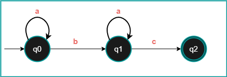

# Automate in Python

## un exemple d'un automate

### presentation graphique



### traduction du donnees

1. les alphabet

    ``` python
    alphabet = ["a", "b", "c"]
    ```

2. les etats

    ``` python
    etats = ["q0", "q1", "q2"]
    ```

3. les transaction

    ``` python
    transaction = {
            'q0': {
                'a': 'q0',
                'b': 'q1'
            },
            'q1': {
                'a': 'q1',
                'c': 'q2'
            }
    ```

4. etat initial et etat finale

    ``` python
        start = 'q0'
        end = ['q1']
    ```
